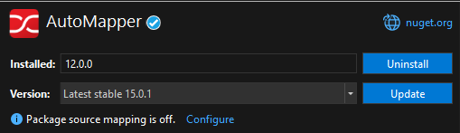
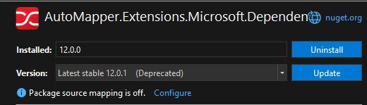

# autoMapper Configuration in .Net 9 Asp.NetCore
### AutoMapper Documentation in ASP.NET Core Implementation in N-Layer Architecture

<br>
<br>

### 1. Install Nuget packages in your project
#### • Install autoMapper 12.0.0 or latest version


#### • Install autoMapper Dependency Injection 12.0.0 or latest version



#### Note : Make sure they use the same version to avoid unnecessary errors.

<br>
<br>

### 2. Create a folder in your solution project and add a class file inside it.


```csharp
using System;
using System.Collections.Generic;
using System.Linq;
using System.Text;
using System.Threading.Tasks;
using AutoMapper;
using SAS_Record_Management_System.Application.DTOs;
using SAS_Record_Management_System.Domain.Entities;

namespace SAS_Record_Management_System.Application.Mappings
{
    public class MappingProfile : Profile
    {
        public MappingProfile()
        {
            CreateMap<["Add your model here"], ["Add your second model here"]>();
        }
    }
   
}

```


<br>
<br>

### 2. Configure autoMapper in Program.cs
```csharp
builder.Services.AddAutoMapper(typeof(MappingProfile));
```
#### • If you have 2 MappingProfile Class
```csharp
builder.Services.AddAutoMapper(typeof(MappingProfile), typeof(ViewMappingProfile));
```


